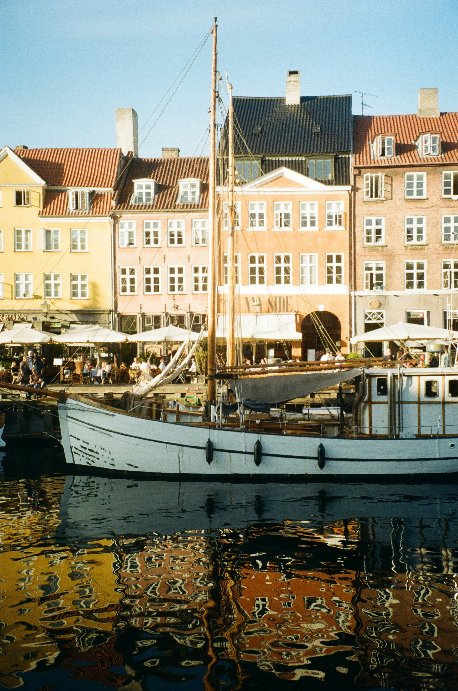
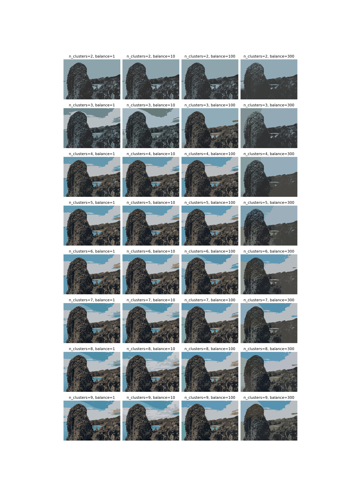
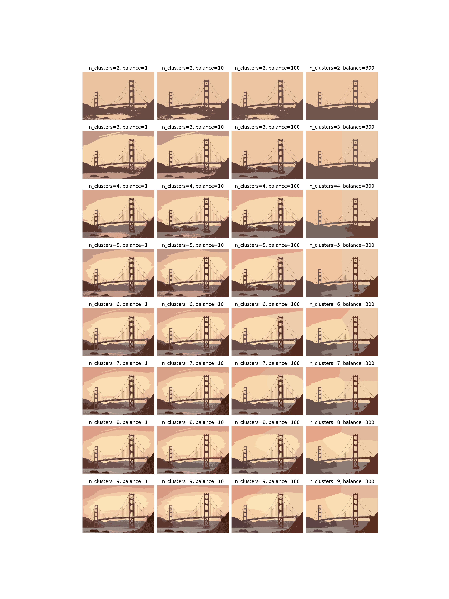
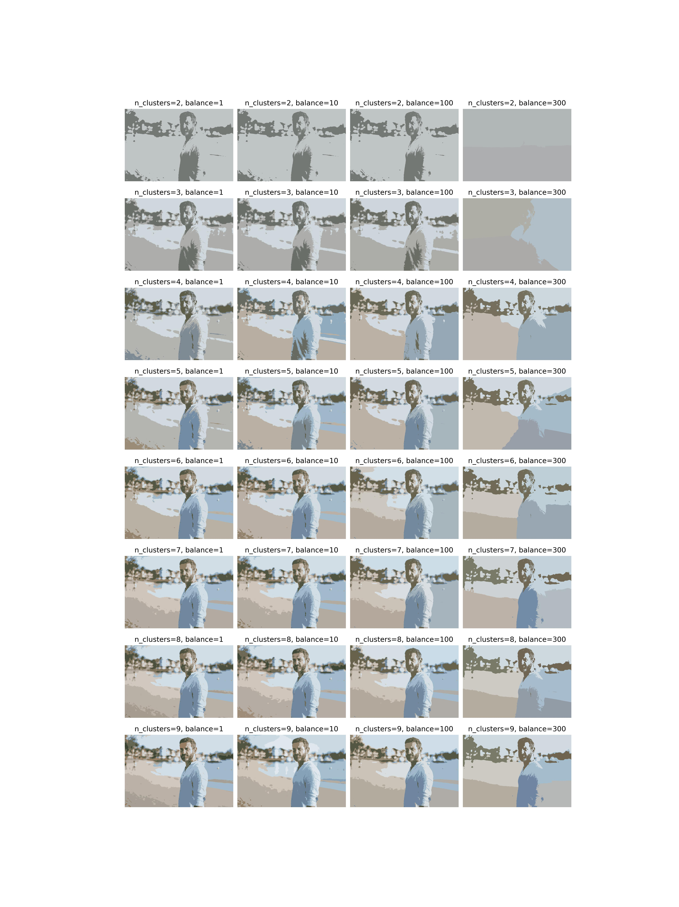

# image-segmentation-clustering
cluster image pixels using k-means clustering based on rgb color and xy coordinate and segment the image using the clusters

just a simple experiment, does not work particularly well

## source images
the source images are taken from unsplash and can be seen below:

## results
for some images with stark differences in color the segmentation works ok, but mostly it falls short in a number of ways

the following grids show segmentation results at various numbers of clusters (increasing from top to bottom) and at various balances between the importance of color and xy coordinate (left: mostly color, right: mostly xy coordinate)

